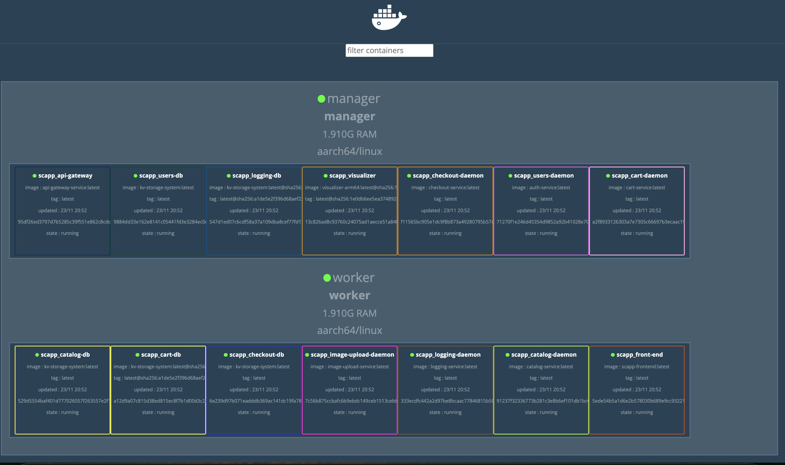
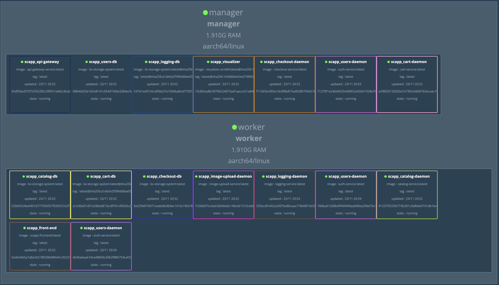
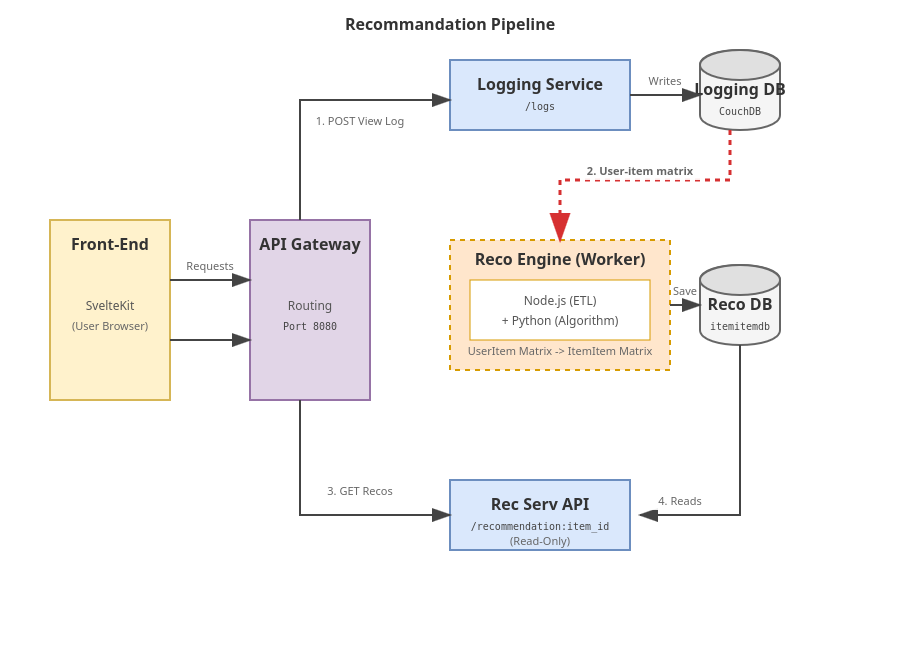
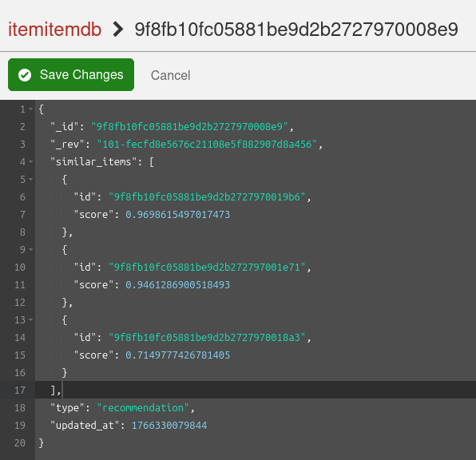
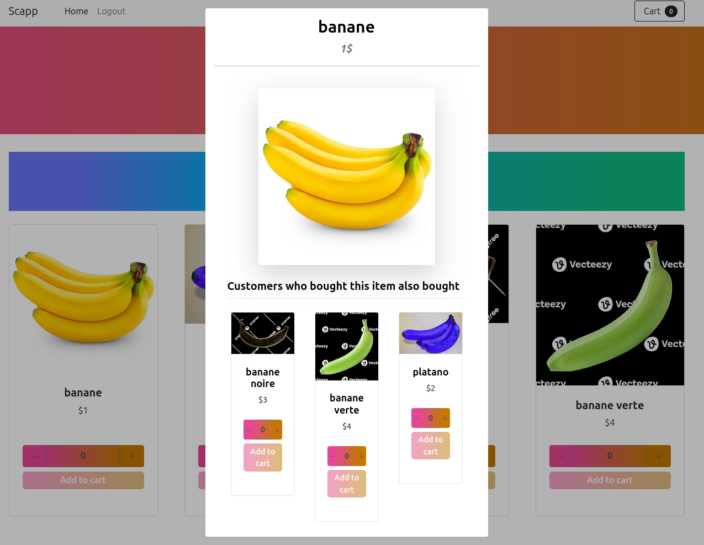

# Scalable Cloud E-Commerce Platform

> **University:** UCLouvain  
> **Project:** Cloud Computing & Microservices Architecture  
> **Role:** Full Stack Cloud Engineer  
> **Status:** Completed  
> **Timeline:** 2025  
> **Tech Stack:** Node.js, Docker Swarm, SvelteKit, CouchDB, Microsoft Azure (VMs, Blob Storage), Python, Nginx

## Overview

This project is a **distributed e-commerce platform** engineered to demonstrate advanced cloud-native capabilities. It decomposes a traditional online shopping experience into **7 loosely coupled microservices**, orchestrated via **Docker Swarm**. The system features extreme fault tolerance, a custom auto-scaling daemon, and an intelligent recommendation engine, simulating a real-world high-traffic retail environment.

## Technical Implementation

*   **Cloud Infrastructure:** The system is architected for full deployment on **Microsoft Azure**. While currently validated via extensive local simulation and stress testing, it features active cloud integration using **Azure Blob Storage** for scalable, off-cluster images asset management.
*   **Microservices Architecture:** Decomposed the application into independent domains (Auth, Catalog, Cart, Checkout, etc.) communicating via a clear API Gateway, ensuring fault isolation.
*   **Custom Auto-Scaling:** Implemented a daemon that monitors cluster CPU metrics in real-time and dynamically scales services (horizontal scaling) to handle traffic spikes.
*   **Intelligent Recommendations:** Developed a background worker using Python and Collaborative Filtering to generate personalized product suggestions based on user interaction history.
*   **Asynchronous Processing:** Offloaded heavy tasks (like image processing) to background queues and external cloud storage (Azure Blob) to maintain low latency for the end-user.
*   **Resilience:** Designed effectively stateless services (using CouchDB) to allow for seamless container restarts and updates without downtime.

---

### 1. System Scalability & Elasticity

The core achievement of this project is its ability to self-regulate. A custom monitoring daemon continuously scrapes CPU telemetry from the Swarm cluster. When load exceeds defined thresholds, the system automatically provisions new replicas.

**Scenario: Handling a Traffic Spike**
Below is a visualization of the **Authentication Service** under a load test (simulated using Artillery).

*   **Before Load:** The services run with minimal resources split between the available VMs to save costs.
    

*   **Scaled State:** As traffic hits the threshold, the orchestrator instantly spawns multiple new replicas to distribute the load.
    

---

### 2. Recommendation Engine Pipeline

To drive user engagement, the platform includes a "Smart Suggestions" feature. This subsystem analyzes user behavior patterns (such as clicks and purchases) to automatically surface relevant products.

**The Pipeline:**
The system ingests raw interaction data and processes it to identify meaningful associations between different items in the catalog.

  

**Behavioral Analysis in Action:**
The engine allows the platform to learn which products are frequently interacted with together, dynamically adapting as new data is collected.

*   **Cold Start / Initial State:**
    Early in the system's life, the dataset is sparse, and few associations exist.

*   **Learning Phase:**
    As users interact with the catalog, the system identifies strong correlations between specific products.
    

*   **Final Output (Frontend):**
    These correlations are translated into personalized suggestions displayed in the user interface.
    

---

### 3. Data Consistency & Architecture

There is no monolithic shared database; instead, distinct services own their data.

*   **Database Technology:** **CouchDB** (NoSQL) was selected for its schema flexibility and HTTP-native API, which simplifies containerized communication.
*   **Isolation:** Each backend microservice (Auth, Catalog, Cart, Checkout, Logs, Recommendation) connects to its own dedicated, isolated CouchDB instance.

This architecture provides **fault isolation**: because resources are not shared, a failure in a critical component (e.g., the Checkout system crashing) is contained, allowing other parts of the application (like Browsing or Login) to remain fully operational.

---

## Academic Integrity Notice

> **Note:** The complete source code, detailed design documents, and configuration files for this project are not publicly available to comply with university academic integrity policies (UCLouvain). This repository serves strictly as a portfolio showcase of the architectural design and resulting implementation.
